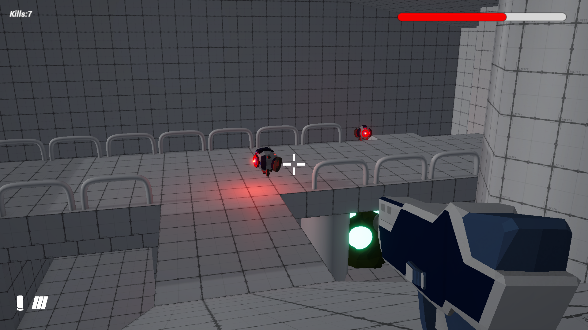
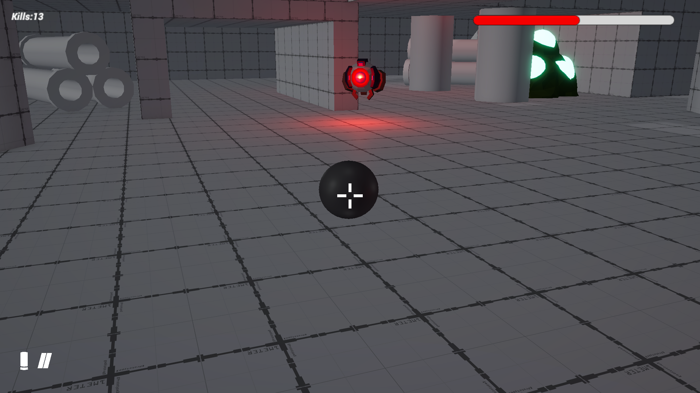

# Deadlock Vector

Deadlock Vector is a Unity-based action shooter built around real-time combat
and a unique time manipulation mechanic that allows players to control
projectiles during slow-motion gameplay.

## Gameplay Overview
- Closed-room arena combat with continuous enemy spawning
- Player health and damage system with close-range enemy attacks
- Fast-paced shooting focused on positioning and reaction time

## Time Manipulation Mechanic
- Bullet-perspective mode allowing the player to directly control projectile trajectory
- Global slow-motion effect during ability activation
- Designed to enable tactical eliminations of distant enemies

## Tech Stack
- Unity Engine
- C#
- Physics-based projectile systems
- Game state and time-scale management

## Media

## Playable Build
▶ **Windows Build:** *(Link will be added)*

## Current Status
- Core gameplay systems complete
- Playable standalone build available
- Further polish and iteration planned
